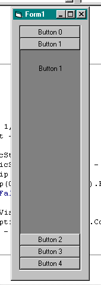

## Outlook Toolbar

### Description

Use an Outlook-Toolbar in your forms without using ActiveX.
 
### More Info
 
The number of "strip"-buttons you use have to fit the number of frames.

             |
---                |---
**Submitted On**   |2000-08-09 15:08:42
**By**             |[M\. Reichelt](https://github.com/Planet-Source-Code/PSCIndex/blob/master/ByAuthor/m-reichelt.md)
**Level**          |Beginner
**User Rating**    |4.6 (46 globes from 10 users)
**Compatibility**  |VB 6\.0
**Category**       |[Custom Controls/ Forms/  Menus](https://github.com/Planet-Source-Code/PSCIndex/blob/master/ByCategory/custom-controls-forms-menus__1-4.md)
**World**          |[Visual Basic](https://github.com/Planet-Source-Code/PSCIndex/blob/master/ByWorld/visual-basic.md)
**Archive File**   |[CODE\_UPLOAD8790892000\.zip](https://github.com/Planet-Source-Code/m-reichelt-outlook-toolbar__1-10557/archive/master.zip)

